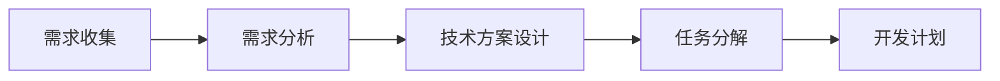
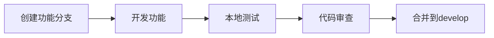
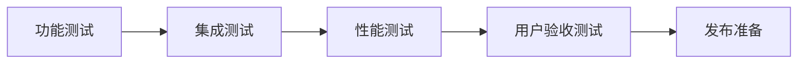
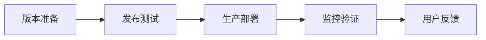

# Echo Command - 团队协作指南

## 👥 团队角色分工

### 项目负责人 (Project Lead)
- **职责**: 项目整体规划、技术决策、进度管理
- **权限**: Admin权限，可以管理仓库设置
- **技能要求**: 全栈开发经验，项目管理能力

### 后端开发工程师 (Backend Developer)
- **职责**: Python后端服务开发、AI集成、系统控制
- **权限**: Write权限，可以推送代码
- **技能要求**: Python、FastAPI、AI/ML、系统编程

### 前端开发工程师 (Frontend Developer)
- **职责**: Electron桌面应用开发、用户界面设计
- **权限**: Write权限，可以推送代码
- **技能要求**: Vue.js、Electron、UI/UX设计

### 云端服务工程师 (Cloud Developer)
- **职责**: Java云端服务开发、数据库设计、API开发
- **权限**: Write权限，可以推送代码
- **技能要求**: Java、Spring Boot、数据库、微服务

### 运维工程师 (DevOps Engineer)
- **职责**: 部署、监控、CI/CD、基础设施管理
- **权限**: Write权限，可以管理部署
- **技能要求**: Docker、Kubernetes、监控、自动化

### 测试工程师 (QA Engineer)
- **职责**: 测试用例设计、自动化测试、质量保证
- **权限**: Triage权限，可以管理Issues
- **技能要求**: 测试框架、自动化测试、质量保证

## 🔄 开发工作流

### 1. 需求分析阶段


**参与角色**: 项目负责人、各开发工程师
**输出**: 需求文档、技术方案、开发计划

### 2. 开发阶段


**参与角色**: 各开发工程师
**输出**: 功能代码、测试用例、文档

### 3. 测试阶段


**参与角色**: 测试工程师、各开发工程师
**输出**: 测试报告、问题清单、修复方案

### 4. 发布阶段


**参与角色**: 运维工程师、项目负责人
**输出**: 发布版本、部署文档、监控报告

## 📋 任务分配模板

### 功能开发任务
```markdown
## 任务: 语音识别优化
**负责人**: 后端开发工程师
**优先级**: 高
**预计工期**: 3天
**依赖**: 无

### 任务描述
优化语音识别准确率，支持更多语言

### 技术要求
- 集成Whisper最新模型
- 支持中英文混合识别
- 优化识别速度

### 验收标准
- 识别准确率 > 95%
- 响应时间 < 2秒
- 支持中英文混合

### 相关文件
- backend/services/ai/transcription_service.py
- backend/tests/test_transcription.py
```

### 问题修复任务
```markdown
## 任务: 修复WebSocket连接问题
**负责人**: 后端开发工程师
**优先级**: 紧急
**预计工期**: 1天
**依赖**: 无

### 问题描述
WebSocket连接在某些情况下会断开

### 问题分析
- 连接超时处理不当
- 心跳机制不完善
- 错误处理缺失

### 解决方案
- 实现自动重连机制
- 优化心跳检测
- 完善错误处理

### 验收标准
- 连接稳定性 > 99%
- 自动重连成功率 > 95%
- 错误日志完整
```

## 🗓️ 会议安排

### 每日站会 (Daily Standup)
- **时间**: 每天上午9:30-9:45
- **参与人员**: 全体开发团队
- **内容**: 
  - 昨天完成了什么
  - 今天计划做什么
  - 遇到了什么阻碍

### 周例会 (Weekly Review)
- **时间**: 每周五下午2:00-3:00
- **参与人员**: 全体团队成员
- **内容**:
  - 本周工作总结
  - 下周工作计划
  - 项目进度汇报
  - 问题讨论

### 技术评审会 (Technical Review)
- **时间**: 每两周一次，周三下午3:00-4:00
- **参与人员**: 技术团队
- **内容**:
  - 技术方案评审
  - 代码质量讨论
  - 技术难点攻关
  - 最佳实践分享

### 发布评审会 (Release Review)
- **时间**: 每次发布前
- **参与人员**: 全体团队成员
- **内容**:
  - 功能演示
  - 测试结果汇报
  - 发布计划确认
  - 风险评估

## 📊 进度跟踪

### 项目看板
使用GitHub Projects创建项目看板：

**列设置**:
- 📋 Backlog (待办)
- 🔄 In Progress (进行中)
- 👀 Review (审查中)
- ✅ Done (完成)

**标签设置**:
- `priority:high` - 高优先级
- `priority:medium` - 中优先级
- `priority:low` - 低优先级
- `type:feature` - 新功能
- `type:bug` - 问题修复
- `type:enhancement` - 功能改进
- `type:documentation` - 文档更新

### 里程碑管理
```markdown
## 里程碑: v1.1.0
**目标日期**: 2024-02-15
**状态**: 进行中

### 主要功能
- [ ] 多语言支持
- [ ] 性能优化
- [ ] 用户界面改进
- [ ] 文档完善

### 完成标准
- 所有功能开发完成
- 所有测试用例通过
- 文档更新完成
- 性能指标达标
```

## 🔍 代码审查流程

### 1. 创建Pull Request
```markdown
## PR标题
feat: 添加多语言语音识别支持

## 描述
- 集成Whisper多语言模型
- 支持中英文混合识别
- 优化识别准确率

## 变更内容
- 修改: backend/services/ai/transcription_service.py
- 新增: backend/tests/test_multilang.py
- 更新: README.md

## 测试
- [ ] 单元测试通过
- [ ] 集成测试通过
- [ ] 性能测试通过

## 相关Issue
Closes #123
```

### 2. 代码审查检查清单
- [ ] 代码逻辑正确
- [ ] 代码风格一致
- [ ] 注释完整清晰
- [ ] 测试用例充分
- [ ] 性能影响评估
- [ ] 安全性检查
- [ ] 文档更新

### 3. 审查反馈
```markdown
## 审查意见

### 👍 优点
- 代码结构清晰
- 注释详细
- 测试覆盖充分

### 🔧 需要改进
- 第45行可以优化性能
- 建议添加错误处理
- 文档需要更新

### ❓ 问题
- 这个函数的时间复杂度是多少？
- 是否需要考虑并发安全？
```

## 📈 质量保证

### 代码质量指标
- **测试覆盖率**: > 80%
- **代码重复率**: < 5%
- **圈复杂度**: < 10
- **技术债务**: 定期评估

### 性能指标
- **响应时间**: < 2秒
- **并发用户**: > 100
- **内存使用**: < 500MB
- **CPU使用**: < 50%

### 安全要求
- **依赖漏洞**: 0个高危漏洞
- **代码扫描**: 通过静态分析
- **权限控制**: 最小权限原则
- **数据加密**: 敏感数据加密

## 🚀 发布管理

### 版本发布流程
1. **功能冻结**: 停止新功能开发
2. **测试阶段**: 全面测试和修复
3. **发布准备**: 版本号、文档、部署
4. **生产发布**: 部署到生产环境
5. **监控验证**: 监控系统状态
6. **用户通知**: 发布公告和文档

### 回滚计划
- **自动回滚**: 关键指标异常时自动回滚
- **手动回滚**: 人工确认后执行回滚
- **数据恢复**: 确保数据一致性
- **用户通知**: 及时通知用户

## 📚 知识管理

### 技术文档
- **架构文档**: 系统架构和设计决策
- **API文档**: 接口规范和示例
- **部署文档**: 环境配置和部署步骤
- **运维文档**: 监控、告警、故障处理

### 最佳实践
- **代码规范**: 统一的编码标准
- **Git工作流**: 分支管理和提交规范
- **测试策略**: 单元测试、集成测试、端到端测试
- **部署策略**: 蓝绿部署、金丝雀发布

### 经验分享
- **技术分享**: 定期技术分享会
- **问题总结**: 故障复盘和经验总结
- **工具推荐**: 开发工具和效率提升
- **学习资源**: 技术学习和成长路径

## 📞 沟通协作

### 沟通渠道
- **即时沟通**: Slack/钉钉/企业微信
- **异步沟通**: GitHub Issues/PR
- **文档协作**: 在线文档平台
- **视频会议**: 腾讯会议/Zoom

### 协作工具
- **代码管理**: GitHub
- **项目管理**: GitHub Projects
- **文档协作**: Notion/语雀
- **设计协作**: Figma
- **监控告警**: 自建监控系统

### 冲突解决
- **技术分歧**: 技术评审会讨论
- **优先级冲突**: 项目负责人决策
- **资源冲突**: 团队协调解决
- **进度延期**: 及时沟通和调整

---

**通过规范的团队协作流程，确保项目高质量、高效率地推进！** 🎉


